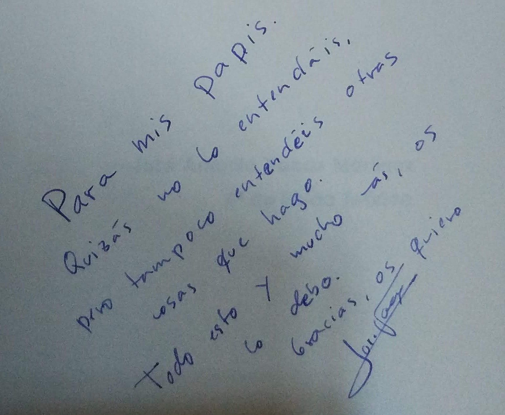

# Introducción a la dinámica de los sistemas no-lineales

 by [Kevin Gil](https://www.flickr.com/photos/kevinmgill/44583965185/)

En esta foto vemos los dos tipos de movimiento. Por un lado tenemos el movimiento regular de lo y Europa alrededor de Júpiter. Por otro lado la Gran Mancha Roja, un enorme remolino, que presenta movimiento turbulento, típicamente caótico. 

# [Introducción a la dinámica de los sistemas no-lineales](./Introduccion_dinamica_sistemas_no-lineales.md)

## José Antonio Vacas Martínez @javacasm

1992, 4º de Física Teórica 

## [Recursos](./Recursos.md)